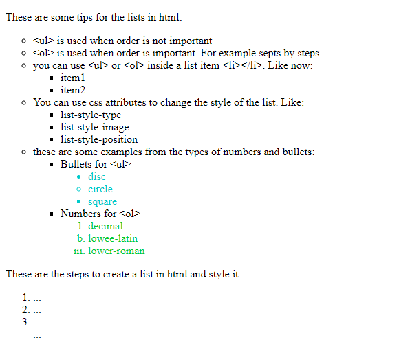

# List in our HTML page
## Write a new HTML page using the tags &lt;ul&gt;, &lt;ol&gt; and &lt;li&gt;. 

* Write the list in a new HTML file. The page should look similar to the one on the following image:
 

Then use the list-style-type to change the bullets and number for the lists. The types are written in the text. Don't forget the color for the little lists. Also fill the steps to "write lists en html and style it" in the bottom list. 

*hint: use the style attribute for the last two list in the item list tag*
**See the image for reference**